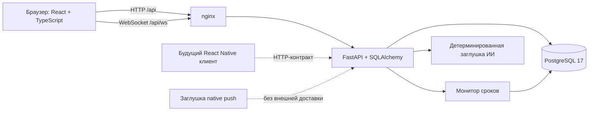
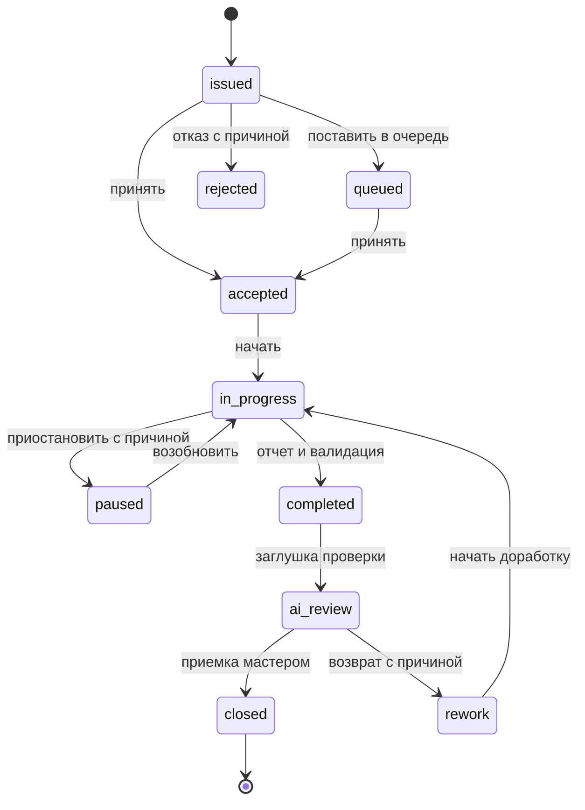

# Архитектура НарядAI

## Компоненты



В Docker Compose nginx раздает собранную Vite панель и проксирует API без смены origin. PostgreSQL не публикует порт на хост; порты веба и сервера доступны только через `127.0.0.1`. API можно открыть напрямую для Swagger и проверки. Для внешнего доступа нужны осознанное изменение привязки портов и HTTPS-прокси.

SQLAlchemy позволяет использовать PostgreSQL при полном запуске и SQLite для локальной разработки. Создание схемы и начальное заполнение выполняются при старте. Alembic-миграция `0001_initial` устанавливает исходную схему и может принять уже инициализированную демобазу без удаления данных. Последующие изменения существующих таблиц должны оформляться отдельными миграциями: автоматическое создание отсутствующих таблиц не заменяет обновление схемы.

## Данные и доступ

Основные сущности: пользователи и хэшированные сессии, участки, оборудование, бригады, коды дефектов, материалы, нормы времени, наряды, события нарядов, отчеты о выполнении, расход материалов, фотографии, проверки ИИ и уведомления. Все данные вымышленные.

В наряде сохраняются участок, оборудование, исполнитель, бригада при групповом назначении, мастер, тип работы, приоритет, срок и временные отметки выполнения. Групповое назначение в MVP разрешается в конкретного доступного ведущего исполнителя с сохранением идентификатора бригады. Это не полноценный учет участия каждого члена бригады.

Каждый переход статуса и изменение существенных параметров оставляет событие с пользователем, временем и комментарием. Исполнитель может работать только с назначенными ему нарядами. Руководитель имеет доступ к чтению. Только мастер/администратор принимает результат, возвращает его на доработку и управляет назначениями; справочники изменяет администратор. Фильтрация и права применяются на сервере, а не только скрытием кнопок.

После входа клиент передает токен в `Authorization: Bearer …`. В БД хранится хэш токена; для WebSocket токен передается параметром соединения. nginx не пишет адрес WebSocket с токеном в access log. При внедрении за другим прокси также требуется исключить токены из журналов.

Фотографии перед загрузкой в хранилище проходят проверку формата и сжатие в JPEG. Разрешено до пяти фотографий каждого вида «До»/«После», размер входящего файла ограничен 10 МБ. Бинарные JPEG сохраняются в PostgreSQL вместе с метаданными; получение требует авторизации и проверки доступа к наряду. Благодаря этому резервная копия БД включает фотографии, но размер БД растет с объемом медиаданных.

## Жизненный цикл



Отмена доступна по серверным правилам с обязательной причиной и сохраняет историю. `completed` фиксируется как отдельное событие перед `ai_review`; текущая карточка после завершения ожидает мастера. Для внеплановой работы обязательно фото «После». Просрочка является вычисляемым признаком относительно срока, а не дополнительным статусом.

## Актуализация и уведомления

После изменений сервер отправляет по авторизованному WebSocket короткое событие (`orders.updated` или `notifications.updated`) без персональных данных. Клиент перечитывает доступные ему данные. При потере связи используется опрос с интервалом 5 секунд. Сервер повторно проверяет действительность сессии при сообщениях клиента и не реже раза в 30 секунд даже на молчащем соединении; отзыв/истечение сессии закрывает соединение. Фоновый монитор регулярно проверяет сроки; уведомления сохраняются в БД и доступны после обновления страницы.

WebSocket-менеджер находится в памяти процесса. Конфигурация Docker запускает один процесс API; горизонтальное масштабирование требует общего pub/sub и распределенной координации фоновых задач. Реальная мобильная доставка не реализована: заглушка не отправляет ничего во внешние сервисы.

## Аналитика и заглушки

Сервер агрегирует историю по периоду, участку, оборудованию, сотруднику и бригаде. Статистика нарядов, простои, материалы и рейтинги строятся по данным БД. Рейтинг является объяснимой формулой, а не выводом машинного обучения. Статусы/оценки демонстрационной истории не являются реальной производственной оценкой работников.

Рейтинг исполнителя считается только по закрытым нарядам выбранной выборки, в шкале 0–100:

```text
рейтинг = (средняя оценка мастера / 5) × 60
        + доля выполненных в срок (%) × 0,30
        + (100 − доля нарядов с доработкой (%)) × 0,10
```

Доля выполненных в срок сравнивает время завершения работ со сроком; задержка ручной приемки мастером не ухудшает этот показатель. Доработкой считается наличие события `rework`. При отсутствии закрытых работ исполнитель не включается в рейтинг. Простои выводятся из сохраненных минут простоя нарядов, суммы материалов сохраняют единицы измерения. Демонстрационная подсказка о максимальном численном расходе не является сравнением стоимости или физического объема разных материалов.

Проверка ИИ возвращает детерминированный учебный результат и `is_stub=true`. Аналитические текстовые подсказки также помечены как заглушки; они демонстрируют интерфейс будущей интеграции. ИИ не обходит валидацию сервера и не закрывает наряд. Фактическую приемку выполняет человек.

`native-stub/` не является приложением. Это TypeScript-порт HTTP API плюс явно не реализованные функции камеры, push и пример очереди только в памяти. Для реальной офлайн-работы понадобятся постоянное хранилище, идемпотентные команды, разрешение конфликтов и безопасное хранение токена.
