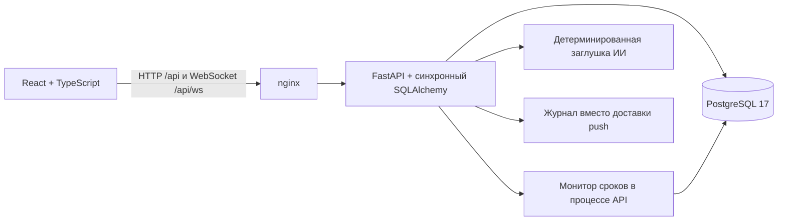
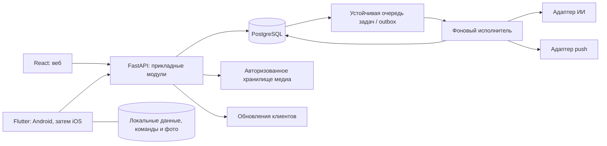

# Архитектура НарядAI

Документ разделяет реализованное состояние и целевую архитектуру полного приложения. База аудита — коммит `322c3d4`; описанные ниже дефекты не считаются исправленными только вследствие обновления документации.

Единые решения команды и открытые вопросы: [decisions.md](decisions.md). Очередность и критерии готовности: [implementation-plan.md](implementation-plan.md). Текущий HTTP API и переходы: [api-contract.md](api-contract.md). Изменения поведения сначала согласуются в этих документах, затем одновременно отражаются в сервере и клиентах.

## 1. Что реализовано сейчас

- `frontend/`: веб-панель React/Vite. nginx раздаёт сборку и проксирует API в одном origin. Docker Compose публикует веб и API на `127.0.0.1`; PostgreSQL доступен внутри сети Compose.
- `backend/`: FastAPI, синхронный SQLAlchemy, PostgreSQL для полного запуска; SQLite используется для локальной разработки и части тестов.
- `native-stub/`: TypeScript-порт API и примеры нереализованных камеры, push и очереди в памяти. Это **не мобильное приложение и не основа выбранного Flutter-клиента**; сохраняется как историческая заготовка до замены.
- При запуске вызываются создание отсутствующих таблиц и начальное заполнение. Alembic присутствует, но миграция `0001_initial` использует живые модели через `Base.metadata.create_all()`: она не фиксирует неизменяемую исходную схему. Перед расширением БД этот дефект необходимо устранить.

### Данные, доступ и медиа

Существуют пользователи, хэшированные сессии, участки, оборудование, бригады, справочники, наряды, события, фотографии, уведомления, записи расхода материалов и оценки ИИ. Текущий отчёт хранится в JSON наряда; отдельной полной неизменяемой версии каждой сдачи нет.

Бригадное назначение сейчас выбирает одного ответственного исполнителя и сохраняет `brigade_id`. Доступ остальных участников и персональный вклад не реализованы. Работник видит свои назначения; руководитель читает данные; мастер и администратор принимают результат, возвращают на доработку и управляют назначениями; администратор ведёт справочники. Проверки выполняет сервер.

HTTP использует `Authorization: Bearer …`; в БД хранится хэш токена. WebSocket передаёт токен параметром соединения. nginx исключает этот URL из access log; любой новый прокси также должен исключать секреты из журналов.

Сервер проверяет изображение, учитывает ориентацию и сжимает его в JPEG; входной файл ограничен 10 МБ, разрешено до пяти фото каждого вида «До»/«После». JPEG и метаданные хранятся в PostgreSQL; чтение требует доступа к наряду. Это упрощает резервное копирование, но увеличивает размер БД.

### Жизненный цикл и актуализация

Полная действующая матрица разрешённых переходов приведена в [api-contract.md](api-contract.md). Обычный путь: `issued → accepted → in_progress → completed → ai_review → closed`. Это пример, а не исчерпывающая схема: есть очередь, отказ, пауза, доработка, отмена и переназначение через редактирование.

`completed` сейчас фиксируется событием, а синхронная заглушка ИИ сразу переводит наряд в `ai_review`. Мастер закрывает наряд с оценкой либо возвращает его на доработку. Для сдачи внеплановой работы сервер требует фото «После». Просрочка вычисляется из срока, не является отдельным статусом. `queued` пока не содержит позиции очереди.

После записи сервер отправляет авторизованным клиентам `orders.updated` или `notifications.updated`; клиент перечитывает доступные данные. Опрос раз в пять секунд сейчас работает постоянно, включая активный WebSocket. WebSocket не переподключается, и открытая аналитика не всегда обновляется. Список ограничен первой тысячей записей; поиск по ним не заменяет серверную пагинацию.

WebSocket-менеджер и монитор находятся в процессе API; текущий запуск использует один процесс. Монитор сохраняет уведомления в БД, push-заглушка лишь записывает интеграционный журнал. ИИ возвращает `is_stub=true`, не анализирует содержание фото и не принимает работу за мастера.

### Ограничения, которые нельзя переносить в полную версию

| Область | Текущее ограничение | Требуемое свойство |
|---|---|---|
| Назначения | Таймер принятия привязан к созданию наряда даже после переназначения | Отдельная история и время каждого назначения |
| Отчёты | Новая сдача заменяет часть старого JSON; фото относятся к наряду целиком | Неизменяемые попытки с собственными материалами, фото и оценками |
| Периоды | Аналитика предварительно отбирает наряды по `created_at` | Отдельный момент учёта для каждого показателя |
| Простои | Суммируются длительности нарядов от создания | Фактические интервалы остановки оборудования с объединением пересечений |
| Конкурентность | Синхронные SQL-запросы внутри `async`-обработчиков; загрузка фото удерживает блокировку через `await` | Единая модель выполнения, короткие транзакции, отсутствие ожидания медиа/сети под блокировкой |
| Миграции | Результат старой миграции зависит от текущих моделей | Неизменяемая схема каждой ревизии и проверяемое обновление существующей БД |
| Команды клиентов | Нет устойчивой идемпотентности и версии записи | Повтор безопасен; устаревшая команда явно отклоняется |

Риск блокировки процесса из-за сочетания синхронной БД, `async` и блокировок требует отдельной проверки на PostgreSQL; это не заявленный результат нагрузочного испытания.

## 2. Целевая архитектура

Сохраняем React, FastAPI, SQLAlchemy и PostgreSQL. Развиваем **модульное приложение с общим сервером**, без обязательного выделения микросервисов. Мобильный клиент — Flutter: Android первым, затем iOS. ИИ, настоящий push и полноценный офлайн входят в объём реализации.

Диаграмма показывает ответственность компонентов, а не выбранные продукты. Брокер/исполнитель фоновых задач, конечное хранилище медиа и провайдер ИИ ещё не выбраны. PostgreSQL остаётся источником достоверных производственных данных.

### Границы модулей сервера

| Модуль | Ответственность |
|---|---|
| Идентификация и доступ | Сессии, роли, область видимости, устройства |
| Наряды и назначения | Переходы, история назначения, бригады, очередь, версия наряда |
| Смены и выполнение | Календарные смены, интервалы работы/паузы, вклад участников |
| Сдача и приёмка | Версии отчётов, вложения, расход материалов, решение мастера |
| Оборудование | Справочник, история ремонтов, интервалы недоступности |
| Уведомления и задания | Outbox, доставка, повторные попытки, напоминания и эскалации |
| ИИ и аналитика | Адаптеры модели, оценки отчётов, проверяемые расчёты и объяснения |

Бизнес-правила находятся в прикладных сервисах, используются всеми клиентами и проверяются сервером. SQLite не подтверждает поведение блокировок PostgreSQL: миграции, ограничения, параллельные переходы и повторы проверяются на PostgreSQL.

### Инварианты модели работ

1. **Назначение — отдельная запись.** Сохраняются начало и конец назначения, ответственный и состав участников на момент работ. Таймер и ключ дедупликации уведомления относятся к назначению, а не к дате создания наряда.
2. **Бригада получает общий наряд.** Участники видят его, их работы, фотографии и материалы сохраняют авторство; ответственный сдаёт общий результат. Общая оценка относится к бригаде, персональная оценка не копируется всем автоматически. Конкретные права действий участников уточняются в контракте до реализации.
3. **Каждая сдача создаёт версию отчёта.** В ней фиксируются работы, шифр, комментарий, вложения, новые списания и авторы. Доработка создаёт следующую попытку и не переписывает прежнюю. Повтор той же команды не повторяет расход.
4. **Результат ИИ связан с версией.** Задача содержит идентификатор и версию отчёта, набор фото, версию модели/правил; запоздавший результат не меняет более новую попытку. Сбой и низкая уверенность видны пользователю.
5. **Очередь упорядочена.** «За текущими» имеет явную позицию и проверяемые правила изменения. Ограничения одновременной работы проверяет сервер в транзакции.
6. **Простой отличается от труда.** Остановка и восстановление оборудования дают интервалы недоступности; работа и паузы исполнителей учитываются отдельно. Пересечения остановок одного оборудования объединяются, интервалы обрезаются границами отчёта. Несколько ремонтных нарядов не умножают простой.

### Время и аналитика

Храним моменты в UTC, границы смен и пользовательское время рассчитываем в действующей зоне приложения **`Asia/Almaty`**. Часовой пояс компьютера разработчика не меняет правила приложения. Текущие смены 08:00–20:00 и 20:00–08:00 сохраняются до согласования календаря; целевая модель поддерживает календарные смены.

В целевых отчётах используем полуоткрытый период `[from, to)`: выданные наряды — по выдаче, завершённые работы — по моменту сдачи с явно указанным правилом учёта повторных попыток, принятые — по приёмке, материалы — по времени проводки, простой и труд — по пересечению интервалов с периодом. Нельзя предварительно ограничить все эти показатели датой создания наряда. Определение каждого показателя и правило дедупликации должны быть в контракте отчёта.

Расчёт количества, сроков, материалов и рейтинга выполняет проверяемый код. Текущая формула рейтинга — 60% оценки мастера, 30% доли завершённых в срок, 10% отсутствия доработок — описывает демонстрацию и не утверждает окончательные веса полного рейтинга. Полная версия добавляет сложность, повторные отказы и вклад бригад; определения, веса и контрольные примеры фиксируются до реализации. ИИ объясняет данные, не подменяет арифметику.

### API, Flutter и офлайн

- OpenAPI и [api-contract.md](api-contract.md) задают одинаковые поля, статусы, ошибки и права для TypeScript и Dart. Клиенты получают типизированные модели из единой спецификации; изменения схемы проверяются на совместимость.
- Каждая изменяющая команда имеет устойчивый идентификатор; сервер хранит результат выполнения и проверяет повторное использование с другим содержимым. Версия наряда/отчёта защищает от применения устаревших изменений. Конкретный формат полей закрепляется в контракте до использования клиентами.
- Flutter хранит локальные данные, очередь действий, идентификаторы команд и файлы фото на диске; очередь переживает закрытие приложения. Фото сжимаются до отправки, сессия хранится безопасно.
- При восстановлении сети клиент синхронизирует команды с соблюдением зависимостей. Сервер повторно проверяет права, назначение, версию и статус; конфликт показывает актуальные данные и требует осмысленного разрешения. Изменение наряда другим человеком не затирается автоматически.
- Переназначение, отзыв доступа, истечение сессии, повтор отправки и завершение другим пользователем входят в сценарии приёмки офлайна. Локально сохранённое действие не показывается как подтверждённое сервером.

### Фоновые задачи, медиа и интеграции

Изменение данных и запись outbox выполняются в одной транзакции. Фоновый исполнитель забирает устойчивые задания, повторяет временные сбои и сохраняет результат. Доставка допускает повторы, обработчики идемпотентны. Сетевые вызовы ИИ/push и обработка больших файлов выполняются вне блокирующей транзакции наряда. Уведомление в БД, попытка push и подтверждение пользователем — разные события.

WebSocket служит сигналом перечитать состояние, а не единственным местом хранения событий. Клиенты переподключаются, перечитывают состояние после разрыва и обновляют связанные списки и отчёты. Общий pub/sub нужен при запуске нескольких процессов; масштабирование вводится вместе с координацией монитора, а не только увеличением числа API-процессов.

Доступ к фото всегда проверяется сервером. Текущий PostgreSQL-подход можно сохранить на первом этапе; перенос бинарных файлов в отдельное хранилище требует согласованного резервного восстановления метаданных и объектов. Выбор продукта и срок хранения пока открыты.

ИИ изолирован адаптером: внешний API и локальная модель должны возвращать один внутренний формат. Разрешение передавать описания и фотографии внешнему провайдеру **не получено**. Реальную передачу нельзя включать до решения; разработка контрактов, тестовых примеров и локальных заглушек продолжается независимо.

## 3. Открытые правила и совместимость

- Сохранение неполной попытки без обязательного фото — предложение, а не принятое правило. Пока действует серверный отказ при сдаче внеплановой работы без фото «После».
- Автоматический возврат по отрицательному вердикту ИИ или подтверждение мастером — открытый вопрос. Пока сохраняется ручная приёмка и ручной возврат; ИИ не закрывает наряд.
- Неопределённые нормативы, веса рейтинга, провайдеры и правила владения данными не заменяются выдуманными значениями. Их статус и последствия для этапов фиксируются в [decisions.md](decisions.md).

Эта архитектура описывает направление реализации. Готовность функции подтверждается кодом и критериями соответствующего этапа [плана](implementation-plan.md), а не наличием её названия в схеме.
