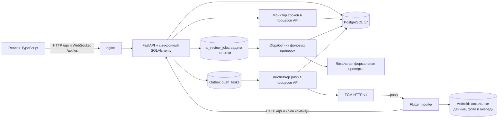
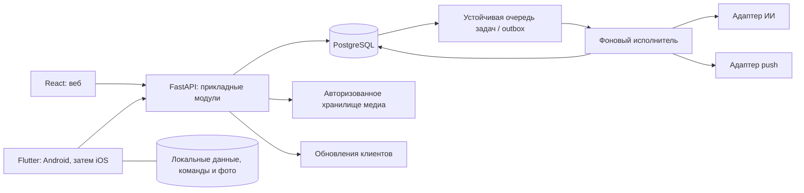

# Архитектура НарядAI

Обновлено 8 октября 2026 года. Документ разделяет реализованное состояние и целевую архитектуру полного приложения. База серверного аудита — коммит `322c3d4`; далее добавлены интерфейсные пакеты, частичный Android-офлайн D17 с серверными ключами повторов и серверный пакет push для Android по D20. Описанные ниже серверные дефекты не считаются исправленными вследствие изменения клиента или документации.

Единые решения команды и открытые вопросы: [decisions.md](decisions.md). Очередность и критерии готовности: [implementation-plan.md](implementation-plan.md). Текущий HTTP API и переходы: [api-contract.md](api-contract.md). Изменения поведения сначала согласуются в этих документах, затем одновременно отражаются в сервере и клиентах.

## 1. Что реализовано сейчас

- `frontend/`: веб-панель React/Vite с рабочими местами мастера/исполнителя, контекстной выдачей и приёмкой. Общая светлая тема с Flutter, канбан/таблицы на компьютере и вертикальные списки на узком экране описаны в [web-ux.md](web-ux.md). nginx раздаёт сборку и проксирует API в одном origin. Docker Compose публикует веб и API на `127.0.0.1`; PostgreSQL доступен внутри сети Compose.
- `backend/`: FastAPI, синхронный SQLAlchemy, PostgreSQL для полного запуска; SQLite используется для локальной разработки и части тестов.
- `mobile/`: Flutter-клиент с онлайн-сценарием и частичным Android-офлайном D17. UI отделён от HTTP-клиента, локального хранилища и ChangeNotifier-контроллера. Android/iOS-сессия через flutter_secure_storage, веб-превью хранит токен только в памяти; iOS не прошёл сборку и приёмку.
- `native-stub/`: TypeScript-порт API и примеры нереализованных камеры, push и очереди в памяти. Это **не мобильное приложение и не основа выбранного Flutter-клиента**; сохраняется как историческая заготовка до замены.
- Push для Android (D20): уведомление в БД дополняется заданием в outbox `push_tasks` (таблицы `push_tasks` и `device_tokens`, неизменяемая миграция `0003_push`); фоновый диспетчер в процессе API отправляет ожидающие задания через FCM HTTP v1 с повторами и нарастающей задержкой и отзывает недействительные токены. Учётные данные сервисного аккаунта сервер получает только из окружения: inline JSON в `FIREBASE_CREDENTIALS_JSON` (приоритет) либо путь к файлу в `FIREBASE_CREDENTIALS`; доставка дополнительно требует явного `PUSH_ENABLED=true`, автоматического выбора ключа из каталога нет; Docker Compose пропускает `FIREBASE_CREDENTIALS_JSON` и оставляет закомментированный монтировочный fallback каталога `backend/secrets` только на чтение. Секреты в репозиторий и в образы не попадают. Это исполнение D14 (задания с сохраняемым состоянием, события после фиксации) и D08 для push: уведомление и задача доставки создаются одной транзакцией, повтор создания уведомления не дублирует outbox; при неопределённом ответе провайдера доставка может повториться. Диспетчер однопроцессный — то же ограничение, что у монитора сроков; согласование нескольких процессов и iOS/APNs не реализованы.
- При запуске выполняются проверяемое обновление Alembic до `0005_ai_review_jobs` и затем начальное заполнение при включённом seed. Цепочка: `0001_initial → 0002_client_commands → 0003_assignment_time → 0003_push → 0004_order_history → 0005_ai_review_jobs`. Ревизии фиксируют схему независимо от рабочих ORM-моделей. Новая миграция добавляет очередь, не запускает проверки старых данных. Старые совместимые схемы принимаются только после проверки, неизвестная/повреждённая схема останавливает запуск. Слепого `stamp` и `create_all()` текущих моделей при старте нет.

### Данные, доступ и медиа

Существуют пользователи, хэшированные сессии, участки, оборудование, бригады, справочники, наряды, события, фотографии, уведомления, записи расхода материалов, оценки ИИ и результаты клиентских команд (`client_commands`). Пакет `feature/order-history`, поверх `feature/postgresql-ci`, добавляет назначения и неизменяемые попытки сдачи: отдельный отчёт, связи с расходом и доступными при сдаче фото, снимок оценки ИИ и отдельные решения мастера. Текущие JSON `completion`/`ai_review` остаются совместимым представлением для старых клиентов; накопленный расход не превращается в расход одной попытки.

Миграция переносит только текущие сохранённые факты с `source=legacy_snapshot`: одно назначение и, если есть `completion`, один снимок отчёта. Автор и связи старой сдачи с фото/списаниями/оценкой неизвестны; они не восстанавливаются. При отсутствии `completed_at` время такого снимка остаётся `null`. Старые строки и аудит сохраняются. Новые назначения и попытки имеют `source=live`; повтор клиентского ключа не создаёт вторую запись истории. Серверные права на чтение истории совпадают с правами на текущий наряд.

Бригадное назначение сейчас выбирает одного ответственного исполнителя и сохраняет `brigade_id`. Доступ остальных участников и персональный вклад не реализованы. Работник видит свои назначения; руководитель читает данные; мастер и администратор принимают результат, возвращают на доработку и управляют назначениями; администратор ведёт справочники. Проверки выполняет сервер.

HTTP использует `Authorization: Bearer …`; в БД хранится хэш токена. WebSocket передаёт токен параметром соединения. nginx исключает этот URL из access log; любой новый прокси также должен исключать секреты из журналов.

Сервер проверяет изображение, учитывает ориентацию и сжимает его в JPEG; входной файл ограничен 10 МБ, разрешено до пяти фото каждого вида «До»/«После». JPEG и метаданные хранятся в PostgreSQL; чтение требует доступа к наряду. Это упрощает резервное копирование, но увеличивает размер БД.

### Жизненный цикл и актуализация

Полная действующая матрица разрешённых переходов приведена в [api-contract.md](api-contract.md). Обычный путь: `issued → accepted → in_progress → completed → ai_review → closed`. Это пример, а не исчерпывающая схема: есть очередь, отказ, пауза, доработка, отмена и переназначение через редактирование.

По умолчанию сдача фиксируется как `completed` вместе с попыткой и задачей `ai_review_jobs`. Фоновая проверка после commit переводит актуальную попытку в `ai_review`; при сбое отчёт сохраняется, задача повторяется или становится `failed`. Для старого синхронного сценария есть явный режим `inline_stub`. Мастер закрывает наряд с оценкой либо возвращает его на доработку только после результата. Для сдачи внеплановой работы сервер требует фото «После». Просрочка вычисляется из срока, не является отдельным статусом. Позиция `queued` рассчитывается по D19.

Обработчик атомарно захватывает задачу с ограниченным сроком и уникальным маркером, завершает транзакцию до вызова адаптера и проверяет маркер/срок заново при фиксации результата. Просроченный захват можно повторить после перезапуска; старый обработчик не может применить ответ. Результат допустим только для текущей попытки и назначения в `completed`; отменённая или более новая сдача делает задачу `superseded`. Оценка и её связи фиксируются один раз, текст/расход/фото попытки не переписываются. Имена/статусы задачи доступны через основной API с правами наряда; внешний AI-сервис не получает доступ к базе или токену пользователя.

После записи сервер отправляет авторизованным клиентам `orders.updated` или `notifications.updated`; клиент перечитывает доступные данные. В веб-клиенте постоянный опрос раз в пять секунд сочетается с WebSocket; параллельные вызовы `refresh` одной сессии объединяются с выполняющимся запросом. После обрыва WS повторяет соединение через 1/2/4/8/15 секунд (далее 15); успешное подключение сбрасывает задержку и обновляет снимок. Ответы прошлой сессии не применяются после выхода/смены токена.

Веб загружает `/orders?limit=5000` и показывает предупреждение при достижении лимита. Поиск и группы ограничены этой выборкой; серверной пагинации нет. Открытая аналитика обновляется по версии общего снимка, отменяет устаревший запрос через `AbortController` и пересчитывает текущую правую границу периода. Выгрузка использует параметры последнего успешно загруженного отчёта; детализация переносит его фильтры и включает закрытые наряды. Это не изменяет предварительный серверный отбор по `created_at` и не исправляет учёт переходящих работ.

Веб не повторяет создание/сдачу автоматически. Он хранит подтверждённый ID при частичной отправке фото и блокирует повтор неизвестно завершившейся записи. Формы находятся в памяти экрана; постоянного веб-офлайн-черновика нет. Веб-пакет D16 не менял HTTP-контракт и БД; более поздний пакет D17 добавил серверные ключи идемпотентности, но React-панель их пока не передаёт.

WebSocket-менеджер, монитор и push-диспетчер находятся в процессе API; текущий запуск использует один процесс. Монитор сохраняет уведомления в БД, push-задачи складываются в outbox и отправляются диспетчером того же процесса. ИИ возвращает `is_stub=true`, не анализирует содержание фото и не принимает работу за мастера.

Непринятие отсчитывается от `assigned_at`: 10 минут, для аварийного приоритета — 3. Явное назначение/переназначение, даже тому же работнику, обновляет момент и ключ дедупликации непринятия; правка срока/приоритета/комментария не меняет назначение. У старых записей новая миграция использует последнее достоверное событие назначения, если оно соответствует текущему назначению и не раньше создания; иначе сохраняет `created_at` как явно ограниченное приближение. Полная история назначений не восстанавливается.

### Первый Flutter-клиент · 6 октября 2026

`mobile/lib/data/` содержит типы, HTTP-клиент и контроллер сессии/данных; `screens/` — рабочие экраны. Старые ответы после смены пользователя отбрасываются. Фото уменьшаются в JPEG до загрузки; чтение фото выполняется с Bearer-токеном. Сроки отображаются через базу часовых поясов `Asia/Almaty`.

Опрос работает каждые 5 секунд при открытом приложении, без гарантии времени доставки с учётом сети. На каждом цикле обновляются в том числе отчёты; это требует оптимизации объёма запросов перед нагрузочной приёмкой. История поиска ограничена 5000 записями с видимым предупреждением при достижении лимита.

### Частичный Android-офлайн · 7 октября 2026

`sqflite` хранит последний снимок полученных данных и очередь команд, `path_provider` задаёт каталоги файлов. Просмотренные фотографии кэшируются с ограничением объёма; файлы очереди сохраняются до подтверждения отправки. Восстановление сессии сначала использует сохранённый профиль, затем проверяет токен в фоне: отсутствие сети не означает выход, `401` прекращает сессию. Flutter web-превью использует хранилище в памяти и может синхронизировать его в открытой вкладке; перезагрузка не сохраняет эту очередь.

Создание, переход, сдача, фото и прочтение уведомления могут попасть в очередь при потере связи. Четыре POST нарядов/фото используют сохраняемый `X-Client-Command-Id`; чтение уведомления повторно устанавливает тот же флаг. Создание должно разрешить локальный идентификатор перед загрузкой зависимого фото; сдача ждёт нужного состояния и фото. Серверное отклонение показывается как конфликт. Локальное сохранение не меняет подтверждённый серверный статус и не является окончательной выдачей/сдачей. Очередь — механизм отправки из работающего приложения, не системный фоновый worker.

Любая команда этого набора записывается с медиа до HTTP-записи, даже онлайн. Android не подменяет неработающее дисковое хранилище памятью: открытие/запись, которые не удались, дают локальную ошибку 507 без отправки действия. Синхронизация сериализована; отказ предыдущей команды блокирует последующие по тому же наряду. `401` сохраняет ожидающую команду и её ключ для повторного входа.

Локальная область включает полный нормализованный адрес API и ID пользователя: снимки, просмотренные фото, очередь и сопоставления ID не смешиваются между серверами/аккаунтами. В secure-storage-сессии сохраняется также ID владельца. Выход очищает снимки/кэш фото только своей области, сохраняя очередь с медиа и сопоставления; другой аккаунт их не получает. Локальная миграция v2 изолирует старые команды без сервера/владельца и не присваивает старые кэши новой области. Старая сессия без владельца требует онлайн-проверки `/auth/me`.

Сервер связывает ключ с пользователем, видом операции, целевым нарядом и содержанием; совпадение только тела запроса недостаточно. Повтор на другой маршрут/наряд возвращает `409`; доступ к целевому наряду проверяется до выдачи прежнего ответа. Для старых результатов перехода/сдачи нужен целочисленный ID целевого наряда в сохранённом ответе, иначе безопасный отказ. Формат HTTP-полей и схема таблицы ключей этим исправлением не меняются; точные правила — в [контракте](api-contract.md).

Неотправленный ввод формы и ещё не переданные контроллеру файлы остаются в памяти; неизвестный исход записи не повторяется автоматически. Подтверждённая запись не считается неуспешной только из-за ошибки обновления экрана. Версий наряда, полного протокола синхронизации и WebSocket ещё нет; push на Android подключён через FCM (см. перечень компонентов выше), но доставка на физическом устройстве не подтверждена, iOS/APNs не подключены. Проверка настоящего дискового хранилища, перезапуска и обрыва связи указывается отдельно в [verification.md](verification.md), а не предполагается по наличию `sqflite` в зависимостях.

### Ограничения, которые нельзя переносить в полную версию

| Область | Текущее ограничение | Требуемое свойство |
|---|---|---|
| Назначения | Новые назначения сохраняются отдельно; до миграции известен только текущий снимок. Бригадные участники ещё не фиксируются | История назначений и участников с достоверным авторством |
| Отчёты | Новые попытки сохраняют отчёт, дополнительный расход, набор доступных фото и оценку. Старые связи неизвестны; фото можно повторно использовать | Асинхронный ИИ привязан к попытке; правила свежести фото после решения Q04 |
| Периоды | Аналитика предварительно отбирает наряды по `created_at` | Отдельный момент учёта для каждого показателя |
| Простои | Суммируются длительности нарядов от создания | Фактические интервалы остановки оборудования с объединением пересечений |
| Конкурентность | Изменяющие HTTP-маршруты выполняют синхронную транзакцию в worker thread; фото готовится до блокировки и повторной проверки прав. Нагрузочная приёмка остаётся | Короткие транзакции; ожидание медиа/сети не удерживает блокировку наряда |
| Миграции | Схема фиксирована ревизиями; заполненные legacy-схемы, backfill и параллельный запуск двух процессов проверяются на настоящей PostgreSQL 17 | Неизменяемые ревизии и сохранность заполненной целевой БД; проверки обновляются при каждом изменении схемы |
| Команды клиентов | Ключи повторов есть для четырёх POST; конкурентные эффекты создания/сдачи проверяются на PostgreSQL. Веб ключи ещё не передаёт, версии записи нет | Повтор безопасен; устаревшая команда явно отклоняется |
| Push | Диспетчер работает в одном процессе API; iOS/APNs и подтверждение аварийного уведомления не реализованы | Устойчивая доставка при нескольких процессах, iOS и подтверждённый ответ на аварийное (R18) |

Изменяющие HTTP-маршруты используют FastAPI threadpool, сохраняя синхронный SQLAlchemy; WebSocket-сигналы публикуются в event loop после commit. Чтение/сжатие фото выполняется без транзакции, удерживающей блокировку наряда; затем проверяются текущая сессия и доступ, берётся блокировка и фиксируется запись. При коллизии номера savepoint откатывает только кандидат; аудит, уведомления и ключ команды фиксируются общей транзакцией. Тесты конкурентных сценариев не заменяют нагрузочную приёмку или согласование нескольких процессов push-диспетчера. Фактические результаты и версии — [verification.md](verification.md).

## 2. Целевая архитектура

После объединения ветки `feature/ai-integration` код отдельного сервиса находится в [ai_service/](../ai_service/README.md). Это необязательный модуль синтетического демо с собственной БД; основной Compose и API его автоматически не запускают, Flutter/React к нему не подключены. До проверки пользовательских прав через gateway `create_app` запрещает backend-mode и внедрение BackendDataSource. Общий service token не заменяет роль пользователя и не предназначен для клиентов. Настоящий провайдер/передача производственных данных остаются Q01, доменные периоды/рейтинг — Q04/Q05; обязательный MobileNetV2 runtime требует отдельной установки и приёмки.

Сохраняем React, FastAPI, SQLAlchemy и PostgreSQL. Развиваем **модульное приложение с общим сервером**, без обязательного выделения микросервисов. Мобильный клиент — Flutter: Android первым, затем iOS. ИИ, настоящий push и полноценный офлайн входят в объём реализации.

Диаграмма показывает ответственность компонентов, а не выбранные продукты. Провайдер push для Android выбран (D20: FCM HTTP v1); брокер/исполнитель фоновых задач, конечное хранилище медиа и провайдер ИИ ещё не выбраны. PostgreSQL остаётся источником достоверных производственных данных.

### Границы модулей сервера

| Модуль | Ответственность |
|---|---|
| Идентификация и доступ | Сессии, роли, область видимости, устройства |
| Наряды и назначения | Переходы, история назначения, бригады, очередь, версия наряда |
| Смены и выполнение | Календарные смены, интервалы работы/паузы, вклад участников |
| Сдача и приёмка | Версии отчётов, вложения, расход материалов, решение мастера |
| Оборудование | Справочник, история ремонтов, интервалы недоступности |
| Уведомления и задания | Outbox, доставка, повторные попытки, напоминания и эскалации |
| ИИ и аналитика | Адаптеры модели, оценки отчётов, проверяемые расчёты и объяснения |

Бизнес-правила находятся в прикладных сервисах, используются всеми клиентами и проверяются сервером. SQLite не подтверждает поведение блокировок PostgreSQL: миграции, ограничения, параллельные переходы и повторы проверяются на PostgreSQL.

### Инварианты модели работ

1. **Назначение — отдельная запись.** Сохраняются начало и конец назначения, ответственный и состав участников на момент работ. Таймер и ключ дедупликации уведомления относятся к назначению, а не к дате создания наряда.
2. **Бригада получает общий наряд.** Участники видят его, их работы, фотографии и материалы сохраняют авторство; ответственный сдаёт общий результат. Общая оценка относится к бригаде, персональная оценка не копируется всем автоматически. Конкретные права действий участников уточняются в контракте до реализации.
3. **Каждая сдача создаёт версию отчёта.** В ней фиксируются работы, шифр, комментарий, вложения, новые списания и авторы. Доработка создаёт следующую попытку и не переписывает прежнюю. Повтор той же команды не повторяет расход.
4. **Результат ИИ связан с версией.** Задача содержит идентификатор и версию отчёта, набор фото, версию модели/правил; запоздавший результат не меняет более новую попытку. Сбой и низкая уверенность видны пользователю.
5. **Очередь упорядочена.** «За текущими» имеет явную позицию и проверяемые правила изменения. Ограничения одновременной работы проверяет сервер в транзакции.
6. **Простой отличается от труда.** Остановка и восстановление оборудования дают интервалы недоступности; работа и паузы исполнителей учитываются отдельно. Пересечения остановок одного оборудования объединяются, интервалы обрезаются границами отчёта. Несколько ремонтных нарядов не умножают простой.

### Время и аналитика

Храним моменты в UTC, границы смен и пользовательское время рассчитываем в действующей зоне приложения **`Asia/Almaty`**. Часовой пояс компьютера разработчика не меняет правила приложения. Текущие смены 08:00–20:00 и 20:00–08:00 сохраняются до согласования календаря; целевая модель поддерживает календарные смены.

В целевых отчётах используем полуоткрытый период `[from, to)`: выданные наряды — по выдаче, завершённые работы — по моменту сдачи с явно указанным правилом учёта повторных попыток, принятые — по приёмке, материалы — по времени проводки, простой и труд — по пересечению интервалов с периодом. Нельзя предварительно ограничить все эти показатели датой создания наряда. Определение каждого показателя и правило дедупликации должны быть в контракте отчёта.

Расчёт количества, сроков, материалов и рейтинга выполняет проверяемый код. Текущая формула рейтинга — 60% оценки мастера, 30% доли завершённых в срок, 10% отсутствия доработок — описывает демонстрацию и не утверждает окончательные веса полного рейтинга. Полная версия добавляет сложность, повторные отказы и вклад бригад; определения, веса и контрольные примеры фиксируются до реализации. ИИ объясняет данные, не подменяет арифметику.

### API, Flutter и офлайн

- OpenAPI и [api-contract.md](api-contract.md) задают одинаковые поля, статусы, ошибки и права для TypeScript и Dart. Клиенты получают типизированные модели из единой спецификации; изменения схемы проверяются на совместимость.
- Каждая изменяющая команда имеет устойчивый идентификатор; сервер хранит результат выполнения и проверяет повторное использование с другим содержимым. Версия наряда/отчёта защищает от применения устаревших изменений. Конкретный формат полей закрепляется в контракте до использования клиентами.
- Flutter хранит локальные данные, очередь действий, идентификаторы команд и файлы фото на диске; очередь переживает закрытие приложения. Фото сжимаются до отправки, сессия хранится безопасно.
- При восстановлении сети клиент синхронизирует команды с соблюдением зависимостей. Сервер повторно проверяет права, назначение, версию и статус; конфликт показывает актуальные данные и требует осмысленного разрешения. Изменение наряда другим человеком не затирается автоматически.
- Переназначение, отзыв доступа, истечение сессии, повтор отправки и завершение другим пользователем входят в сценарии приёмки офлайна. Локально сохранённое действие не показывается как подтверждённое сервером.

### Фоновые задачи, медиа и интеграции

Изменение данных и запись outbox выполняются в одной транзакции. Фоновый исполнитель забирает устойчивые задания, повторяет временные сбои и сохраняет результат. Доставка допускает повторы, обработчики идемпотентны. Сетевые вызовы ИИ/push и обработка больших файлов выполняются вне блокирующей транзакции наряда. Уведомление в БД, попытка push и подтверждение пользователем — разные события.

Для push эта схема уже работает: `notify()` рядом с уведомлением БД в одной транзакции создаёт задание `push_tasks`, а диспетчер того же процесса API отправляет его через FCM, повторяет временные сбои и отзывает недействительные токены. Задачи ИИ и сводок, дедупликация/контроль доставки и согласование нескольких процессов в эту схему пока не входят.

WebSocket служит сигналом перечитать состояние, а не единственным местом хранения событий. Клиенты переподключаются, перечитывают состояние после разрыва и обновляют связанные списки и отчёты. Общий pub/sub нужен при запуске нескольких процессов; масштабирование вводится вместе с координацией монитора, а не только увеличением числа API-процессов.

Доступ к фото всегда проверяется сервером. Текущий PostgreSQL-подход можно сохранить на первом этапе; перенос бинарных файлов в отдельное хранилище требует согласованного резервного восстановления метаданных и объектов. Выбор продукта и срок хранения пока открыты.

ИИ изолирован адаптером: внешний API и локальная модель должны возвращать один внутренний формат. Разрешение передавать описания и фотографии внешнему провайдеру **не получено**. Реальную передачу нельзя включать до решения; разработка контрактов, тестовых примеров и локальных заглушек продолжается независимо.

## 3. Открытые правила и совместимость

- Сохранение неполной попытки без обязательного фото — предложение, а не принятое правило. Пока действует серверный отказ при сдаче внеплановой работы без фото «После».
- Автоматический возврат по отрицательному вердикту ИИ или подтверждение мастером — открытый вопрос. Пока сохраняется ручная приёмка и ручной возврат; ИИ не закрывает наряд.
- Неопределённые нормативы, веса рейтинга, провайдеры и правила владения данными не заменяются выдуманными значениями. Их статус и последствия для этапов фиксируются в [decisions.md](decisions.md).

Эта архитектура описывает направление реализации. Готовность функции подтверждается кодом и критериями соответствующего этапа [плана](implementation-plan.md), а не наличием её названия в схеме.
